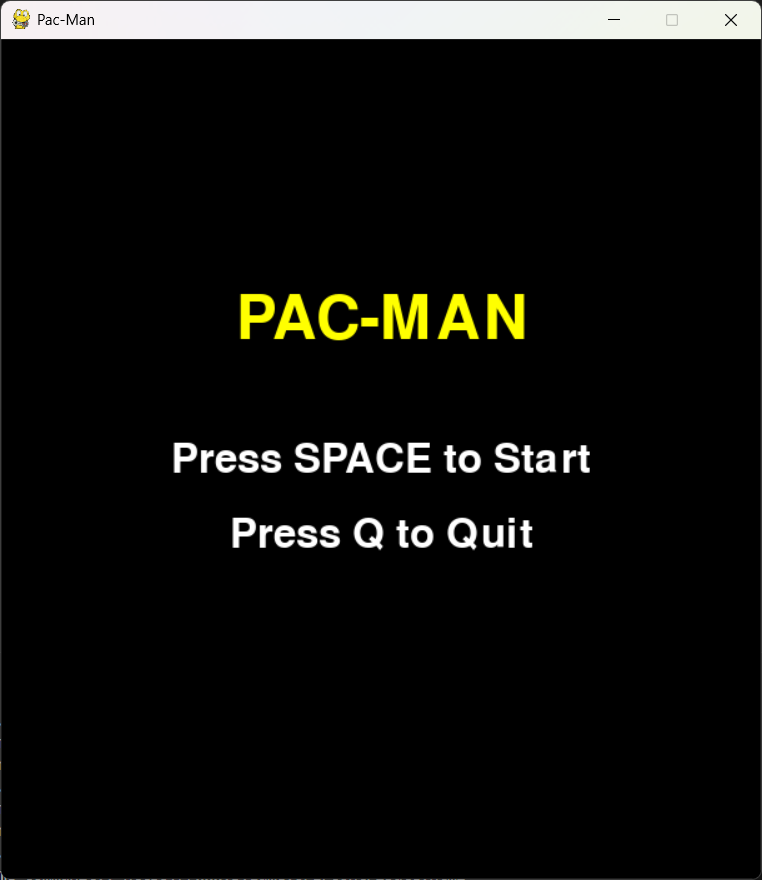
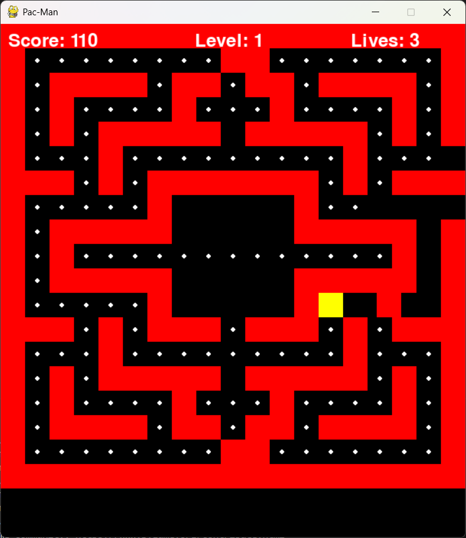
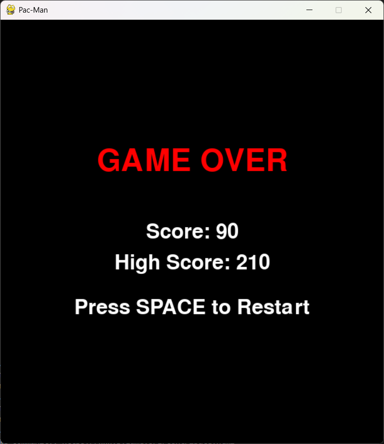

# Grafos1_pacmanMenorCaminho

**Número da Lista**: 1<br>
**Conteúdo da Disciplina**: Grafos<br>

## Alunos
|Matrícula | Aluno |
| -- | -- |
| 21/1042327  |  Carlos Gabriel Cardoso Ramos |
| 20/2016604  |  João Lucas Miranda de Sousa |

## Sobre 
Este projeto demonstra a aplicação de grafos e busca em largura (BFS) no jogo Pac-Man, usando esses conceitos para controlar o comportamento dos fantasmas. Os fantasmas usam BFS para calcular o caminho mais curto até o Pac-Man otimizando a perseguição.

## Screenshots




## Instalação  
**Linguagem**: Python  
**Framework**: Pygame  
**Pré-requisitos**:
- Python 3.13.1
- Pygame

**Comandos para instalação**:  
1. Instale o Python 3, caso ainda não tenha.  
2. Instale o Pygame com o seguinte comando:
    ```bash
    pip install pygame
    ```
3. Clone o repositório.  
    ```bash
    git clone <https://github.com/projeto-de-algoritmos-2025/Grafos1_pacmanMenorCaminho.git>
    ```
## Uso 
1. Navegue até o diretório do projeto:
    ```bash
    cd <pacman>
    ``` 
2. Execute o script principal para rodar o jogo. No terminal, execute o comando:
    ```bash
    python main.py
    ```
2. O jogo será iniciado, e você poderá controlar o Pac-Man com as teclas de seta.  
3. Os fantasmas perseguem o Pac-Man usando o algoritmo de BFS para calcular o caminho mais curto até ele.  
4. O objetivo é coletar todos os pontos sem ser pego pelos fantasmas.  
5. O jogo termina quando o Pac-Man é capturado pelos fantasmas.